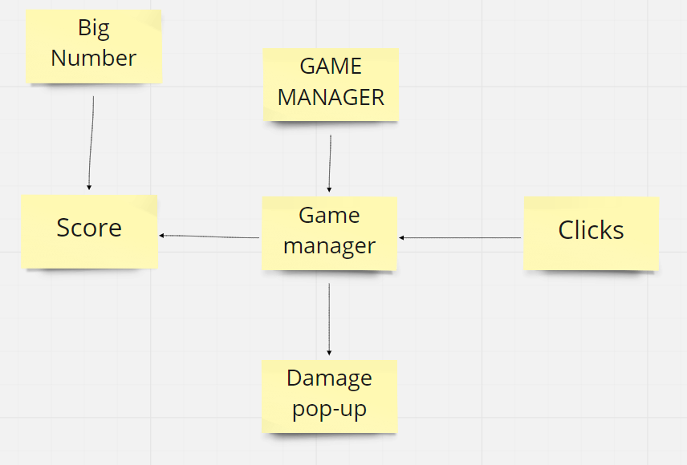
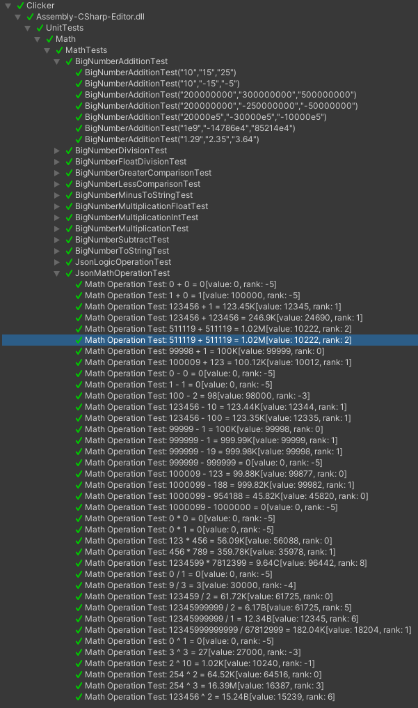

## Игра кликер
Над проектом работали студенты группы 3530904/80103: Сарчук Ярослав Викторович, Валиев Рамазан Тагирович, Иваненко Егор Александрович и Мкртчян Артур Папикович

## Цель работы
Создать инкрементальную игра (idle game) — это компьютерная игра, игровой процесс в которой состоит из выполнения простых действий, таких как многократное нажатие на экран. Нажатия, как правило, выполняются, чтобы заработать игровую валюту. Иногда улучшение дают возможность не выполнять действия постоянно, отсюда и название «idle game».

## Кодирование и отладка
Реализовать проект на языке C# на кросс-платформенном игровом движке Unity.

## Простейшее описание игры в диаграмме

Клики захватываются отдельным компонентом, который их регистрирует и трясет голову игровому персонажу, этот же скрипт отправляется в Game manager, чтобы тот начислил пользователю очки. Game Manager при получании сигнала о начислении очков, выводит их на экран и так же выводит на экран урон, который пользователь нанес одним кликом. Этот урон постоянно повышается, как и начисляемые очки, поэтому встала острая необходимость в структуре для хранения больших чисел [1].
Игровой процесс сопровождается музыкой и изменениями фона игры.

[1] BigNumber - структура которая реализует хранение больших чисел в виде 5 лидирующих разрядов и степени порядка большого числа. Для лучшего понимания опишем на примере: если лидирующие разряды 21 и степень 200, то само число это будет 21 * 10^200.  Также был определён вывод больших чисел. 
Тысяча - K
Миллион - M
Биллион - B
и тд... по буквам 'D', 'E', 'F', 'G', 'H', 'I', 'J', 'L', 'N', 'O', 'P', 'Q', 'R', 'S', 'T', 'U', 'V', 'W', 'X', 'Y', 'Z', 'A'
При использовании данного решении теряются младшие разряды числа, но достигается высокая эффективность памяти и времени вычисления.
## Тестирование и результаты
Для проекта реализованы Юнит тесты:
1) Сложения больших чисел
2) Деления больших чисел
3) Деления больших чисел на числа с плавающей запятой
4) Логических операций для сравнения больших чисел
5) Вычитания больших чисел
6) Умножения больших чисел на вещественные
7) Умножения больших чисел на целочисленные
8) Умножения больших чисел
9) Преобразорвание строки в большое число

## Пример работы 

